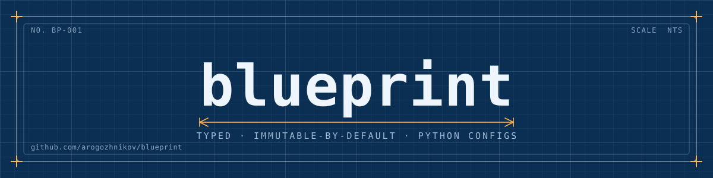

# blueprint

Typed, immutable-by-default config objects for Python.

`blueprint` gives you dataclass-like config classes with real type checking
and a deliberate mutation model: instances are frozen after construction,
and the only way to change one is through an explicit `mutable_copy()`
block, which hands you an independent, deep, mutable copy and re-validates
it when the block exits.

There are multiple config methods, they mostly address wrong problems.

Blueprint focuses on these three: 
- helpful (though not exhaustive) typechecking,
- compositionaly of configs with complex code-level logic,
- reliability

## Install

This project isn't published to PyPI yet. Install it directly from GitHub:

```bash
pip install "blueprint @ git+https://github.com/arogozhnikov/blueprint.git"
```

Or from a local checkout:

```bash
pip install -e ".[dev]"
```

Requires Python 3.11 or newer.

## Quick example

```python
from blueprint import BlueprintCfg, field

class ServerCfg(BlueprintCfg):
    host: str = "localhost"
    port: int = 8080
    tags: list[str] = field(default_factory=list)

    def check(self):
        if not (0 < self.port < 65536):
            raise ValueError("port out of range")

cfg = ServerCfg(host="0.0.0.0", port=8000)

# Instances are frozen -- this raises AttributeError:
# cfg.port = 9000

# Changes go through mutable_copy(), which yields a deep, independent copy
# and validates it (including check()) when the block exits:
with cfg.mutable_copy() as new_cfg:
    new_cfg.port = 9000
    new_cfg.tags.append("staging")

assert cfg.port == 8000        # original untouched
assert new_cfg.port == 9000
```

Fields support plain types, `Optional`/`Union`, `Literal`, `Enum`, nested
`BlueprintCfg` classes, and `list[T]` / `dict[K, V]` / `tuple[...]`
collections, all recursively type-checked on construction and on every
mutation. `blueprint.format()` pretty-prints a config (and its nested
configs/collections), wrapping long lines for readability.

## Nested configs and collections

Mutability cascades: unlocking a config with `mutable_copy()` also unlocks
every nested `BlueprintCfg`, list, and dict field reachable from it, so you
don't need a separate `mutable_copy()` per nested object.

```python
import blueprint
from blueprint import BlueprintCfg, field

class RetryCfg(BlueprintCfg):
    max_attempts: int = 3
    backoff: float = 1.5

class ServiceCfg(BlueprintCfg):
    name: str
    retry: RetryCfg = field(default_factory=RetryCfg)
    endpoints: list[str] = field(default_factory=list)

svc = ServiceCfg(name="api", endpoints=["https://a.example"])

with svc.mutable_copy() as svc2:
    svc2.name = 'other-api'
    svc2.retry.max_attempts = 5 # can modify nested fields
    svc2.endpoints.append("https://b.example")

print(blueprint.format(svc2))
# ServiceCfg(
#   name='other-api',
#   retry=RetryCfg(max_attempts=5, backoff=1.5),
#   endpoints=['https://a.example', 'https://b.example'],
# )
```


## Comparison with other common tools

We have a ton of config libs. Why creating one more? 

Compared to Hydra/OmegaConf/etc: code-based configuration, convenient checks, static typechecking. Overrides without craziness.

Compared to dataclasses: *working* immutability, runtime typechecking, post-modification type-checking.

Compared to pydantic: copy-with-changes in pydantic is very tough:

```python
cfg = cfg.model_copy(
    update={
        "retry": cfg.retry.model_copy(
            update={"max_attempts": 10}
        )
    }
)
# above approach is cumbersome and not typecheckable.
# While in blueprint it is just ...
with cfg.mutable_copy() as cfg:
    cfg.retry.max_attempts = 10
```
Additinally, multiple change paths in pydantic do not trigger revalidation - poor behaviour for configs.


## Important gotchas

Everything that goes into config (in constructor or by assignment) 
is immediately cloned, and has no link connections to previously existing objects.

```python
source_tags = ["a", "b"]
cfg = ServerCfg(tags=source_tags)

source_tags.append("c")  # mutating the list *after* construction...
assert cfg.tags == ["a", "b"]  # ...never shows up in cfg -- its own copy was made

# same story for nested BlueprintCfg instances and for mid-mutable_copy() assignment:
retry = RetryCfg(max_attempts=1)
with ServiceCfg(name="api", retry=retry).mutable_copy() as svc2:
    svc2.retry.max_attempts = 99
assert retry.max_attempts == 1  # the object `retry` still points at is untouched
```

Returned lists / dicts fields are not lists, but their immutable subclasses.
This is usually correct decision, as you should not modify configs or config fields, but also can be confusing if some deeper code assumes the list is modifiable.

There is no yaml/json serialization, on purpose. 
There is a readable reproducible formatting, also on purpose.

## Errors

Field type-check failures raise `InvalidBlueprintError`:

```python
# next line raises InvalidBlueprintError
ServerCfg(host=123, port="oops")
```

Output (note there is a line for every exception):

```
blueprint._blueprint.InvalidBlueprintError: InvalidBlueprintError(
  Invalid type for field ServerCfg.host: Expected <class 'str'>, got int (123)
  Invalid type for field ServerCfg.port: Expected <class 'int'>, got str ('oops')
)
```


`check()` failures (like the `port out of range` example above) are raised
as whatever exception your `check()` method raises -- they aren't wrapped.

## Escape hatches

Two global context managers are available for when the frozen-by-default model gets in the
way. Both are process-wide (not scoped to one instance) and nestable.

```python
import blueprint

# Mutate objects directly and in place, bypassing mutable_copy() entirely. Useful for
# incremental construction or quick experiments -- but note this mutates the object itself
# (no copy), visible to every other reference to it, unlike mutable_copy().
with blueprint.dangerously_all_mutable():
    cfg.port = 9000

# Assert that some region of code never mutates configs: any mutable_copy() call inside
# the block raises RuntimeError instead of yielding a copy.
with blueprint.debug_prohibit_mutability():
    with cfg.mutable_copy() as y:  # raises RuntimeError
        ...
```

## Example

`examples/example.py` is a runnable, commented tour of everything above (and is covered by
a test that runs it, so it can't silently drift out of date):

```bash
python examples/example.py
```


## Development

```bash
uv pip install -e ".[dev]"
pytest
ruff format .
ruff check .
```